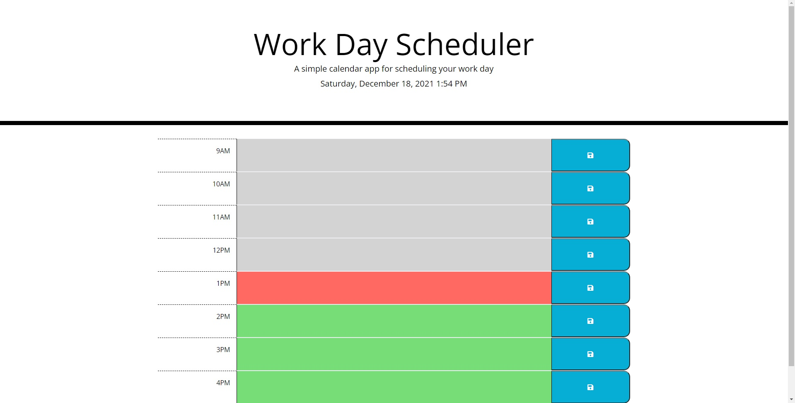
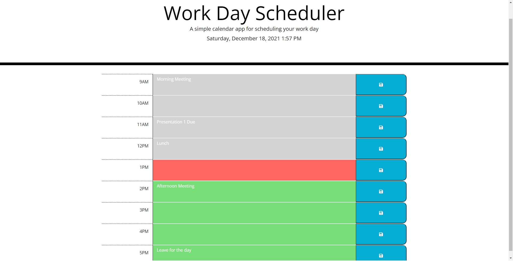

# Work Day Scheduler

[Deployed Application](https://ericcrain77.github.io/work-day-scheduler/)

[GitHub Repository](https://github.com/Ericcrain77/work-day-scheduler)

## Table of Contents
* [Description](#description)
* [User Story](#user-story)
* [Screenshots](#screenshots)
* [Technologies](#technologies)
* [Questions](#questions)

## Description
A simple calendar application that allows a user to save events for each hour of a day. 

## USER STORY

AS AN employee with a busy schedule

I WANT to add important events to a daily planner

SO THAT I can manage my time effectively

## Screenshots
Empty Schedule

Work Scheduler being utilized

## Technologies
This application utilizes the following npm packages:
* Moment.js

## Questions
Reach out to me using my [Github account](https://github.com/Ericcrain77) or my [email](ericcrain77@gmail.com).